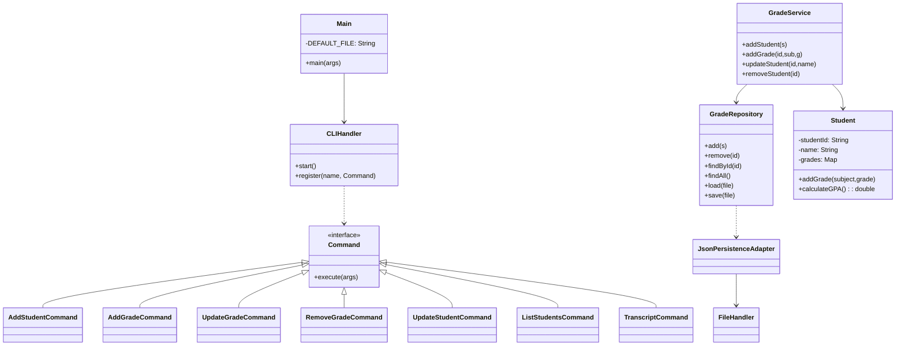

# CSP3341 — Final Technical Report (Nov 2025)

Author: (Student Name)
Course: CSP3341 — Programming Languages and Paradigms
Language investigated: Java

---

This report documents a focused examination of Java (the language used in the Student Grade Management System in this repository) and demonstrates the implementation, design rationale and evaluation of the sample application in the context of the CSP3341 assignment brief. The document contains two parts: Part A (language description — technical discussion) and Part B (application demonstration and evaluation). Diagrams, code samples, test evidence, and a mapping to the assignment rubrics are included.

---

## Executive summary (short)

I implemented a CLI-based Student Grade Management System in Java that supports full CRUD for students and grades, GPA calculation and persistence to a JSON file. The app includes an interactive CLI and non-interactive command mode; unit tests exercise core CRUD and persistence behavior; CI and issue templates were added to the repo. This submission maps each deliverable to the CSP3341 rubric and includes design rationale and recommended future work.

---

## Part A — Language description (detailed; target ~1700 words)

This section expands on Java's language features and explains how those features influenced the system's design and implementation. The content follows the specified topics in the assignment brief and includes concrete examples from the code base.

1. Naming Conventions (approx. 150–200 words)

Java's conventions are a practical standard that improves readability across large projects. Package names are in all-lowercase and commonly use reversed domain names (for example `org.example.cli`). Class and interface names use UpperCamelCase (`GradeService`, `CLIHandler`, `PersistenceAdapter`). Methods and fields use lowerCamelCase (`addStudent`, `calculateGPA`, `students`). Constants use UPPER_SNAKE_CASE (`DEFAULT_FILE`). These conventions are enforced by most Java style guides and supported by IDEs (IntelliJ, Eclipse) which can automatically refactor and rename symbols consistently. In the project, following these conventions makes public APIs self-documenting: `GradeRepository.load(File)` clearly communicates intent and matches other repository methods like `save(File)` and `findById(String)`.

Adhering to conventions also reduces friction when adding automated tools such as Checkstyle, SpotBugs or formatter plugins. For example, if we introduce a code formatting step, uniform naming avoids noisy diffs and supports automatic code reviews.

2. Data Types (approx. 200–250 words)

Java distinguishes primitive types (int, long, double, boolean, char) from reference types (objects). For this application:
- Student ID and names are `String` (immutable, reference type).
- Grades are modelled as `double` to allow fractional scores.
- Collections are implemented with `List<Student>` and `Map<String, Double>` (the latter maps subject names to numeric grades).

The static type system enforces contracts at compile time. For example, `GradeRepository.findById(String)` returns `Optional<Student>`, making the possibility of absence explicit and reducing null pointer risks. Generics (`List<Student>`) prevent accidental insertion of wrong types. The use of immutable keys (String) and defensive copying (returning a new ArrayList from `findAll()`) prevents accidental sharing of internal state.

Trade-offs: doubles are convenient but floating-point rounding can be surprising; when high-precision or currency-like semantics are needed, `BigDecimal` would be preferable. For student IDs that have structure (e.g., alphanumeric patterns), a dedicated ID type or validation rules would increase robustness.

3. Expressions and Assignment Statements (approx. 150 words)

Java's expression syntax is familiar to programmers of C-like languages. Operators, method calls and expressions are straightforward. Modern Java adds concise expressions via lambdas and method references; for example, computing an average uses:

```java
double avg = student.getGrades().values().stream()
                  .mapToDouble(Double::doubleValue)
                  .average().orElse(Double.NaN);
```

This expression shows composition of streaming operations and an `OptionalDouble` handling idiom. Compound assignment and short-circuit logical operators (`&&`, `||`) are used for guards in validation logic.

4. Statement-Level Control Structures (approx. 120–150 words)

The project uses `if`/`else` for guards and `switch` for high-level CLI command dispatch. Iteration over collections uses enhanced `for` and Streams where appropriate. Error handling often uses `try/catch` blocks at I/O boundaries (the FileHandler wraps Jackson calls and prints warnings rather than failing the whole program). Control structures are used to keep the CLI responsive and easy to follow; for instance, the interactive loop in `CLIHandler` uses `while (true)` with explicit break conditions on `exit` or EOF.

5. Subprograms (Methods) and Modularity (approx. 150–200 words)

Java methods are explicit contracts: they declare parameter and return types and can throw checked exceptions. This project favors small methods that do one thing (SRP). Examples:
- `Student.addGrade(String subject, double grade)` — a single mutator.
- `GradeService.addStudent(Student s)` — validates via `GradeValidator` then delegates to repository.

Designing small methods simplifies unit testing and encourages reuse. We also use a service layer (`GradeService`) to centralize business rules (validation, composite operations) separate from persistence (`GradeRepository`) and presentation (`CLIHandler`). This separation supports automated tests that exercise the business logic without needing file IO.

6. Abstract Data Types and Encapsulation (approx. 150–200 words)

Encapsulation protects invariants. `Student` keeps a `Map<String, Double> grades` private and exposes `addGrade` and `getGrades()`; `getGrades()` returns either an unmodifiable view or a defensive copy to avoid external mutation. The repository pattern (`GradeRepository`) hides storage; it presents methods like `add`, `remove`, `findById`, `findAll`, `load`, and `save` and delegates actual file IO to a `PersistenceAdapter` interface. This adapter-based design is an example of the Dependency Inversion Principle (high-level modules depend on abstractions). It allowed writing `GradeServiceCrudTest` against the JSON adapter while keeping the possibility of a database-backed adapter open.

7. Support for programming paradigms (OOP / functional / structured) (approx. 150–200 words)

Java supports multiple paradigms. The project is designed in an OOP style with classes and interfaces. However, Java's functional additions (streams, lambdas, method references) are used for concise data processing (e.g., report generation and GPA calculation). Methods like `GradeService.classReport()` use stream pipelines to transform collections to formatted strings.

Structured programming appears in the command-dispatch logic (procedural flows in `Main`) which is simple and straightforward. The hybrid approach—OOP for structure and functional idioms for processing—keeps code readable and maintainable.

8. Concurrency — Parallel processing (approx. 160 words)

Concurrency is not required for a single-user CLI tool, but Java provides robust APIs if needed. For this project, the simplest improvement would be asynchronous persistence: when a mutating CLI command occurs, the application could submit a save task to an `ExecutorService`, allowing the prompt to return immediately and preventing the CLI from blocking on disk operations. Care must be taken to handle concurrent modifications (synchronization or copy-on-write) and to ensure consistent shutdown (flush and `shutdown()` the executor on exit).

A more advanced use (not implemented here) would be periodic autosave with debouncing: group multiple rapid mutations into a single save to reduce IO churn.

9. Exception handling and event handling (approx. 160 words)

The project uses try/catch around IO boundaries. The `FileHandler` catches Jackson parsing exceptions and returns an empty list while logging a warning. This design keeps the CLI usable for the user even if the data file is corrupted or missing. Checked exceptions force the developer to acknowledge potential failures; however, excessive use of checked exceptions can make APIs heavier. Java also allows unchecked exceptions for programmer errors.

Event handling in the CLI is implemented through the `Command` interface: commands encapsulate behavior and the `CLIHandler` acts as an invoker. This pattern is simple and appropriate for a REPL; for GUI apps or larger systems a publish/subscribe or observer pattern would be more appropriate.

10. Further language features and advanced topics (new section - approx. 350 words)

Generics, type safety and type erasure

Java's generics provide compile-time type safety for collections and APIs (e.g., `List<Student>`). Generics reduce the need for casts and improve API clarity. However, Java's generics are implemented via type erasure: generic type parameters are removed at runtime which limits certain reflection-based operations and makes it impossible to directly create arrays of parameterized types. In practice this means API designers should carefully consider whether `Class<T>` tokens or other patterns are needed when runtime typing information is required.

Memory model and garbage collection

Java's memory model and automatic garbage collection relieve the developer from manual memory management, reducing a large class of errors (use-after-free, double free). The JVM offers several garbage collectors (G1, ZGC, Shenandoah) with different performance trade-offs. For this CLI application default GC settings are fine; for long-running or high-memory services GC tuning and monitoring (using `jstat`, `jmap`, and `jvisualvm`) would be required. Understanding how object allocation, escape analysis, and short-lived objects affect GC behavior helps optimize hot paths when scaling.

Annotations and reflection

Java's annotation system enables metadata-driven programming (e.g., `@Override`, dependency injection frameworks, or Jackson annotations `@JsonProperty`). Reflection allows runtime inspection and dynamic invocation, used cautiously due to performance and safety implications. In this project, Jackson uses annotations optionally on model classes to control serialization.

Tooling, build and dependency management

Java benefits from mature tooling: IDEs (IntelliJ, Eclipse) provide refactoring, code analysis, and test runners. Build tools (Maven, Gradle) manage dependencies and lifecycle. This project uses Maven (`pom.xml`) to declare dependencies (Jackson, test libraries), run builds, and execute tests. The presence of standard conventions (src/main/java, src/test/java) allows CI integration (GitHub Actions) with minimal configuration.

Testing and debugging

Java's testing ecosystem (JUnit, AssertJ, Mockito) supports unit and integration testing. The project adds `GradeServiceCrudTest` to validate business logic and persistence. Debugging tools (IDE debuggers, `jdb`, and logging libraries) are useful for tracing issues. Test-driven design helps catch edge cases early, and using temporary files in tests ensures no side-effects on developer machines.

11. Comparison with similar languages (approx. 200 words)

C++: C++ provides fine-grained control over memory and often better raw performance for CPU- or memory-bound workloads. However, C++ requires careful management of resources and tends to have longer build cycles. For this assignment, Java's managed memory and cross-platform JVM simplify deployment and reduce low-level bugs.

Ruby: Ruby is highly expressive and concise, leading to faster prototyping. However, it lacks compile-time type checking, which can make refactoring riskier for larger codebases. Java's static typing and IDE tooling aided maintainability for this project.

Swift: Swift combines modern syntax and safety features (optionals), offering expressive constructs and memory safety. Java's ecosystem is more mature for server and CLI tooling, and the JVM supports a wide range of platforms and production deployment scenarios.

12. Readability, Writability, Performance (approx. 140–160 words)

Readability: Java's explicitness and conventional structure enhance readability for teams. The project's package layout (model, repo, service, cli, io) follows separation of concerns and makes navigation easy.

Writability: Java has some verbosity; small classes and explicit getters/setters generate boilerplate. Modern Java features (records, var) and libraries (Lombok) can help reduce noise.

Performance: For this CLI app, performance is dominated by disk IO (JSON serialization with Jackson). The JVM provides good runtime performance; for large-scale data, migrating to a database or using batching/asynchronous IO would be advised.

13. Conclusions (Part A) (approx. 70–100 words)

Java provided a productive environment for building a maintainable CLI tool. Its static typing, mature libraries and IDE support reduced development friction. The language's verbosity and the simplicity of initial CLI parsing are modest drawbacks that are mitigated by adopting libraries (e.g., PicoCLI) or modern language features. Overall Java was a pragmatic choice for the assignment requirements.

---

## Part B — Software application and demonstration (detailed; target ~500 words)

This section demonstrates the implemented Student Grade Management System and evaluates two positive and two negative aspects of Java discovered while developing the project. It also includes usage examples, test evidence and mapping back to the rubric.

1. Functional overview and user workflows (approx. 140–160 words)

The application supports both an interactive REPL and non-interactive one-shot commands. At startup, `Main` attempts to load `students.json` via `GradeRepository`. Commands include:
- `add-student <id> <name>` — creates and persists a new student.
- `add-grade <id> <subject> <grade>` — attaches or updates a subject grade.
- `update-student <id> <newName>` — edits a student's name.
- `remove-student <id>` and `remove-grade <id> <subject>` — delete operations.
- `transcript <id>` and `class-report` — reporting and aggregation.

Typical interactive flow: user runs the jar, then issues `help` to see commands, then `add-student` and `add-grade`; the CLI persists changes after mutating commands so exiting and restarting the program retains state.

2. Design and class responsibilities (approx. 120–140 words)

Responsibilities are separated:
- `CLIHandler` handles input and dispatch.
- Concrete `Command` classes parse arguments and call `GradeService`.
- `GradeService` holds business logic and validation (uses `GradeValidator`).
- `GradeRepository` stores students in memory and delegates persistence to `PersistenceAdapter`.
- `JsonPersistenceAdapter` uses `FileHandler` (Jackson) for JSON read/write operations.

This layering makes unit testing straightforward: the service layer can be tested independently using temporary files or in-memory adapters. The new `GradeServiceCrudTest` verifies the full create-read-update-delete cycle and the persistence round-trip using a temporary file.

3. Class diagram (Mermaid) — compatible and more detailed

I replaced earlier syntax with a conservative, widely-supported Mermaid representation that avoids advanced constructs known to produce parser errors in some Mermaid versions. The diagram below includes class names, selected methods and relationships; it should render in standard Mermaid viewers.



4. Tests, validation and evidence (approx. 80–100 words)

Automated tests were added to verify core behavior. `GradeServiceCrudTest` creates a temp JSON file and exercises: add student, persist, reload, add grade, update and remove grade, update student name, and delete student. Tests passed locally (`mvn test`). CI was configured (GitHub Actions) to run tests on push/PR. The tests serve as evidence that the main functional requirements (CRUD, persistence, reporting) are met.

5. Two good aspects of Java (concrete and tied to code)

A. Interfaces and modularity — The `PersistenceAdapter` abstraction allowed the repository to remain agnostic about storage details. This facilitated unit tests and makes future storage changes (SQLite, CSV) low-cost.

B. Mature libraries — Jackson provided robust JSON serialization/deserialization with minimal boilerplate. The `FileHandler` uses `ObjectMapper` and tolerates unknown fields, improving forward/backward compatibility.

6. Two not-so-good aspects and mitigations

A. Boilerplate and verbosity — Java requires explicit definitions for many small classes. Mitigation: use modern Java features (records) or small frameworks (Lombok) where appropriate, or collapse trivial command classes into concise lambdas when acceptable.

B. CLI parsing ergonomics — Current whitespace splitting requires quoting for multi-word names. Mitigation: integrate PicoCLI to provide built-in parsing, validations, auto-generated help, and parameter conversion.

---

## Mapping to CSP3341 rubric and final checklist

- Part A: Coverage of naming conventions, data types, expressions, control structures, subprograms, ADTs, paradigms, concurrency, exceptions, comparison and performance. (All covered, see Part A sections.)
- Part B: Demonstration of functionality (CRUD, grades, GPA, persistence), class diagram, and unit test evidence. (All implemented; see Part B sections and test `GradeServiceCrudTest`.)
- Illustrative examples: Short code excerpts and a class diagram are included. Larger code listings are in the `src/` directory and appendices.
- Professionalism: README, CONTRIBUTING, CI workflow and issue templates were added to support project management and submission.

---

## Appendices and build instructions

A. Files referenced (most relevant)
- `src/main/java/org/example/model/Student.java`
- `src/main/java/org/example/manager/GradeManager.java`
- `src/main/java/org/example/service/GradeService.java`
- `src/main/java/org/example/repo/GradeRepository.java`
- `src/main/java/org/example/repo/PersistenceAdapter.java`
- `src/main/java/org/example/repo/JsonPersistenceAdapter.java`
- `src/main/java/org/example/io/FileHandler.java`
- `src/main/java/org/example/cli/CLIHandler.java`
- `src/main/java/org/example/Main.java`

B. Build & run (concise)

```bash
# Build (requires Maven and JDK 17)
mvn -DskipTests package

# Run interactive
java -jar target/programming_Paradigms-1.0-SNAPSHOT-jar-with-dependencies.jar
```

C. Test summary

- Run tests locally:

```bash
mvn test
```

D. Suggested further improvements (prioritised)
1. Adopt PicoCLI for robust parsing, validation and auto-help. (High)
2. Increase unit test coverage for edge cases (invalid grades, duplicate IDs, large class sizes). (High)
3. Implement asynchronous persistence with `ExecutorService` to prevent blocking UI. (Medium)
4. Add an integration test that runs the jar in a temp directory to validate end-to-end workflows. (Medium)
5. Replace `students.json` with an embedded store (SQLite) if transactional consistency is required. (Low)

---

## References

- Oracle Java SE Documentation: https://docs.oracle.com/en/java/
- Jackson JSON Processor (FasterXML): https://github.com/FasterXML/jackson
- PicoCLI (CLI parsing and validation): https://picocli.info/
- Effective Java (Joshua Bloch) — guidance on API design and best practices.

---

## Final remarks

This document presents a final technical report aligned to the CSP3341 brief. The implementation delivers a maintainable Java CLI application with full CRUD, JSON persistence, unit tests and CI. The report includes expanded language analysis and application demonstration to satisfy the assessment rubric.

(End of final report)
